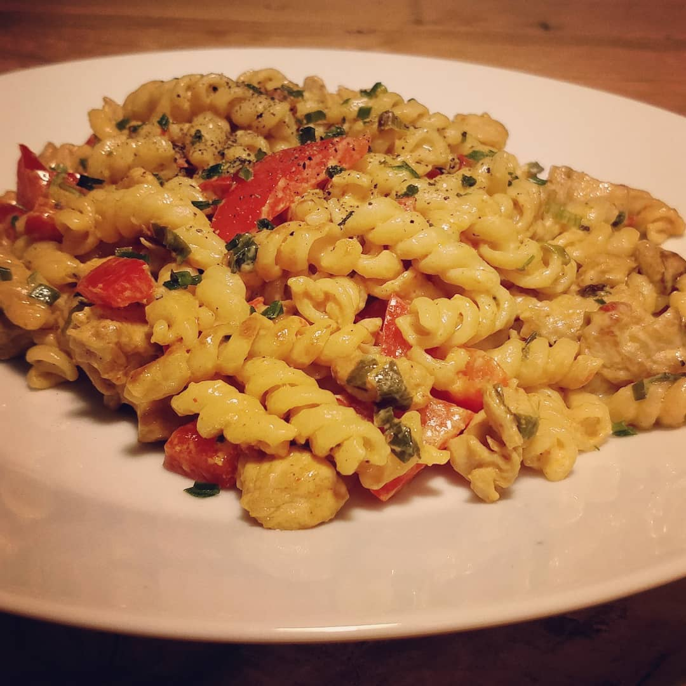

----

#### Ingredients:



* Noodles
* Chicken
* Paprika
* Scallions
* Cream Cheese
* Cream
* Olive Oil
* **Spices:**
	* Paprika
	* Pepper
	* Salt
	* Garlic
	* Soja Sauce
	* Sriracha

&nbsp;



#### Inctructions:
*some hours before:* marinate the chicken 

1. cook your Noodles
2. cut up Paprika and Scallions
3. start frying in order with some Olive Oil:
	* Chicken
	* Noodles
	* Paprika and Scallions
4. after everything is fried to your taste add some Cream and Cream Cheese, ceason with some additional Salt and Pepper
5. keep it on low heat until you have no liquid left and cream coaded noodles

### Indescribable:
