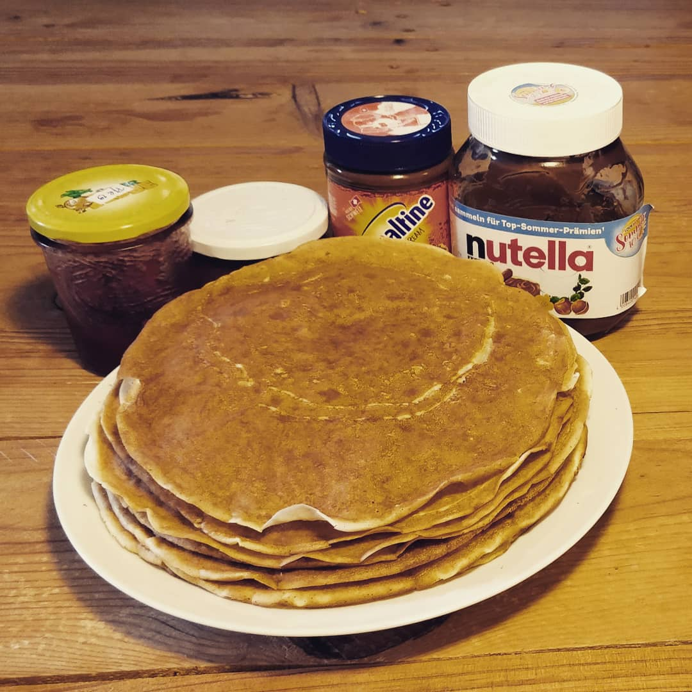

----

#### Ingredients:



* Milk 
* Flour
* Oatmeal
* Baking Powder
* Egg
* Vegetable Oil
* **Spices:**
	* Salt

&nbsp;



#### Inctructions:
1. put everything together to a good pourable batter
2. spread the batter in an oiled pan by moving the pan so you get a full thin coverage
3. flip with a spachelor after gaining some color

 *don't panic the first one is always shit*

### Indescribable:
