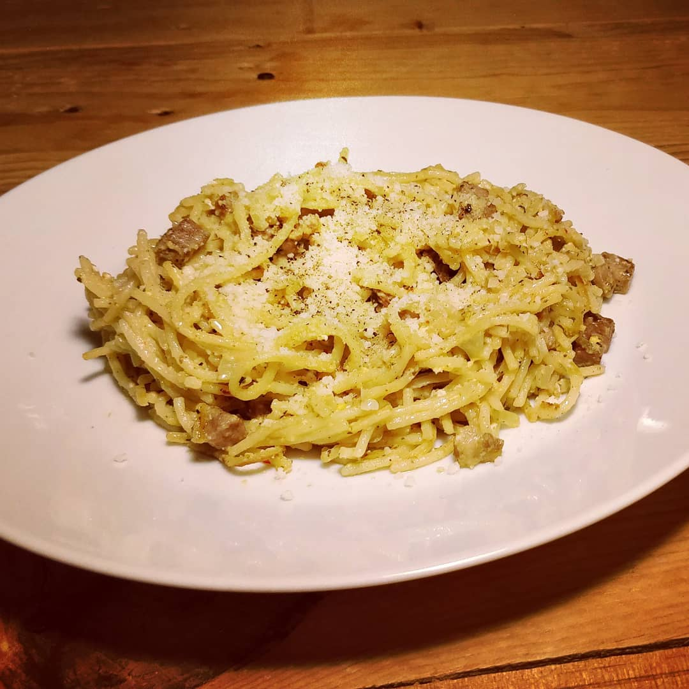

----

#### Ingredients:



* Noodles
* marinated BBQ Steak
* Onion
* Garlic
* Cream
* Cream Cheese
* **Spices:**
	* Pepper

&nbsp;



#### Inctructions:
*some time before:* freeze the Steak

1. cook your Noodles
2. cut up Onion and Garlic, Steak(cuts better a little frozen)
3. with some Olive Oil start frying in order:
	* Steak
	* Noodles
	* Onion
4. after everything is fried to your taste add some Cream and Cream Cheese, ceason with some additional Pepper
5. keep it on low heat until you have no liquid left and Cream coaded Noodles
6. serve with some Parmesan(because more cheese always wins) 

### Indescribable:
