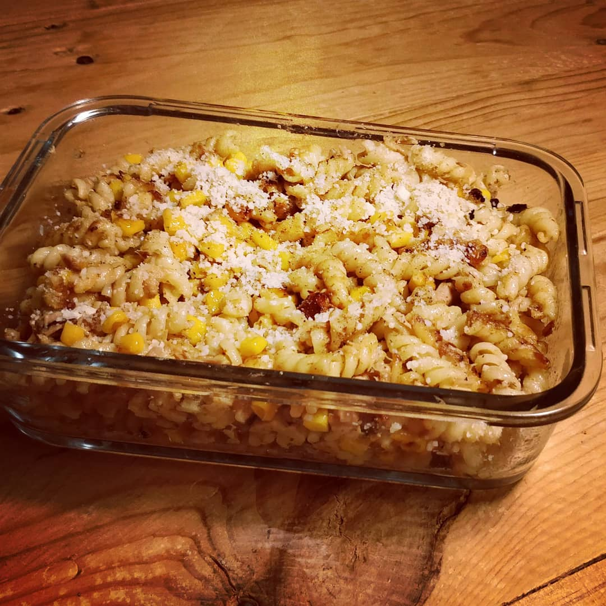

----

#### Ingredients:



* Noodles
* canned Tuna
* canned Corn
* **Spices:**
	* mustard

&nbsp;



#### Inctructions:
1. Cook your Noodles
2. drain the oil from the Tuna in the Pan
3. start frying in order:
	* Noodles
	* Tuna
	* Corn
4. add some Mustard
5. I like it if everything has a nice litte char
6. serve with some Parmesan(because more cheese always wins)

### Indescribable:
